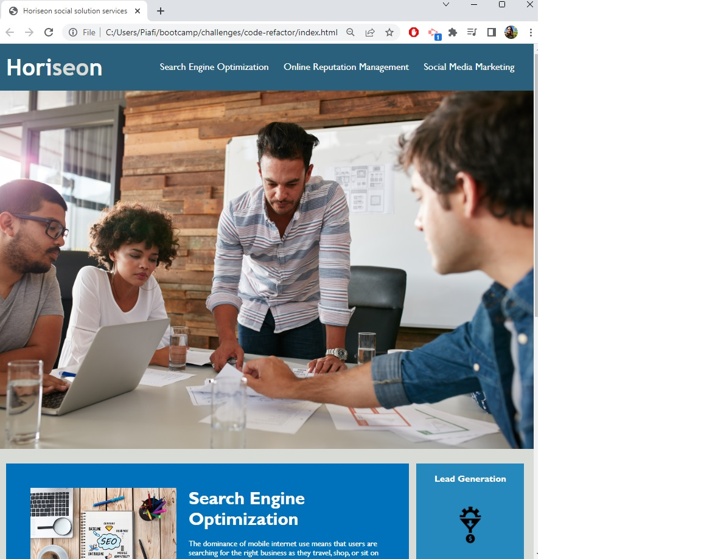

# User Story
```
Given a starter code
I want to make changes so it follows accessibility standards
SO THAT our own site is optimized for search engines

```

# Refactored base code:
```
Added:
* title to the website
* html semantic elements (header, nav, img, section, article, footer)
* Alt attributes to images
* comments in boths html and css file

fixed:
* fixed navegation link
* heading attributes in order
* consolidated repetitive css elements and organized css style to follow the semantinc elements of html.
```

# Screenshot:


